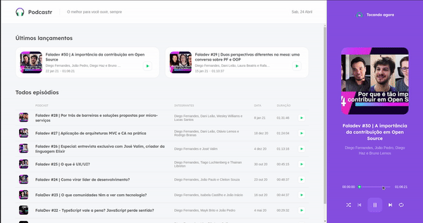

# NLW5 Podcaster

Projeto de uma plataforma para rodar audios de podcasters.

## Ferramentas utilizadas

* React
* Next
* TypeScript
* Sass

## Iniciar Projeto

<b>1º Clone esse repositório no seu computador ou baixe no formato (ZIP).</b>

<b>2º Abra o seu terminal e na raiz do projeto rode o comando `npm install` ou `yarn` para baixar todas as depêndencias do projeto.</b>

<b>3º Rode o comando `yarn server` ou `npm run server` para iniciar o Json Server.</b>

<b>4º Rode o comando `yarn dev` ou `npm run dev` para iniciar o front.</b>

# Projeto em ação:

